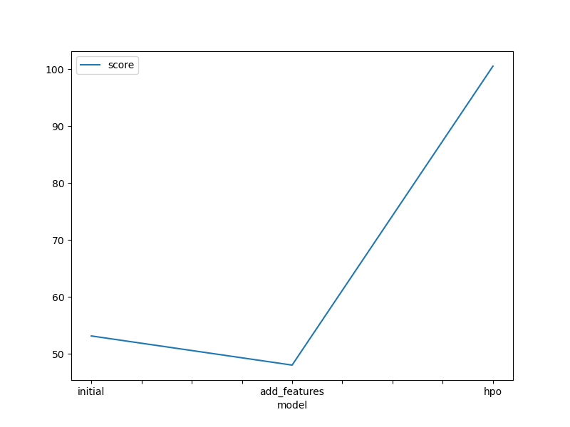

# Report: Predict Bike Sharing Demand with AutoGluon Solution
#### Adrian Cuevas Tavizon

## Initial Training
### What did you realize when you tried to submit your predictions? What changes were needed to the output of the predictor to submit your results?
TODO: Add your explanation
I had certain problems when trying to submit in Kaggle because I had forgotten to eliminate the negative values, later I realized that it is mandatory to modify the values ​​less than 0 to be 0, it should be noted that none of my models gave negative values, but at the time of assigning the variable I had chosen the wrong one to assign the correct values in ["count"], once this was solved I had no major complications making submissions to Kaggle

### What was the top ranked model that performed?
TODO: Add your explanation
In my case, my best ranked model was the one in which I modified the hyperparameters, being approximately in position 2685 with respect to all participants.

## Exploratory data analysis and feature creation
### What did the exploratory analysis find and how did you add additional features?
TODO: Add your explanation
The exploratory analysis helped me to better understand my results and my data, to be able to better adjust my model to the case study by making a correct fit, I wanted to add something interesting so it seemed appropriate to determine the stage of the day in which There is greater demand.

### How much better did your model preform after adding additional features and why do you think that is?
TODO: Add your explanation
Once this feature was added the model improved slightly; However, it was not a big change, but there was an improvement and I think it is because the model had more useful information to it.

## Hyper parameter tuning
### How much better did your model preform after trying different hyper parameters?
TODO: Add your explanation
By trying different hyper parameters, the model greatly increased its performance, improving by more than 100% in the Kaggle score, having much more solid results.

### If you were given more time with this dataset, where do you think you would spend more time?
TODO: Add your explanation
If I used more time, I think it would take more time to find a suitable model for the situation, making a better fit, I would also focus on improving the quality of the data and removing values that do not have a great correlation with the objective since they can be distracting

### Create a table with the models you ran, the hyperparameters modified, and the kaggle score.
|model|hpo1|hpo2|hpo3|score|
|--|--|--|--|--|
|initial|NN_TORCH|dropout_prob': 0.100776|presets: best quality|1.80244|
|add_features|NN_TORCH|dropout_prob': 0.100776|presets: best quality|1.52827|
|hpo|GBM|GBMLarge|presets: best quality|0.86474|

### Create a line plot showing the top model score for the three (or more) training runs during the project.

TODO: Replace the image below with your own.

### Create a line plot showing the top kaggle score for the three (or more) prediction submissions during the project.

TODO: Replace the image below with your own.

## Summary
In summary, although initially the results obtained in the predictions were not as expected, considering that I had enough data to get closer to a model with more adequate predictions, once I started making the modifications a great improvement in the model, the selection of appropriate hyper parameters being of utmost importance according to the conditions of the model itself and the data, the final model turned out to be more precise and effective, the tools provided by autogluon are very useful for training.